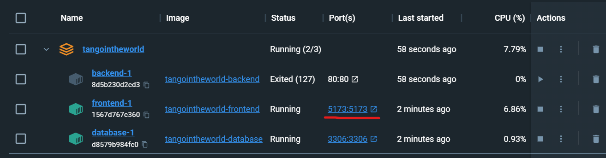

# TangoInTheWorld

Just a website

## Development

**Requisiti:**
- wsl (solo su Windows, installabile dal Microsoft Store)
- Docker Desktop
- GitKraken (consigliato)
- DBeaver (consigliato, installabile dal Microsoft Store)

**Installazione:**
1. Avviare Docker Desktop
1. Aprire GitKraken (o il client git desiderato) e clonare il repository
1. Prendere spunto dal file `.env.example` per creare un file `.env` e impostare le variabili a proprio piacimento
1. Aprire un terminale nella cartella del progetto ed eseguire il comando:
   ```
   docker-compose up
   ```
   Questo comando si occuperà di creare le immagini e i container su Docker e di avviarli.
1. Una volta avviati i container possiamo chiudere il terminale e passare a docker desktop, noteremo che il container *backend* ha avuto un errore. Questo succede perché deve attendere l'avvio del database. Ci basterà attendere una decina di secondi e poi si potrà riavviare.

Per visualizzare l'interfaccia web di backend o frontend basterà cliccare sull'associazione tra porte nella lista dei container di Docker Desktop.



## Git

Il repository git è organizzato in branch con scopi ben precisi:
- `main` non ci si possono effettuare le commit direttamente, le modifiche devono provenire da altri branch ed essere applicate tramite pull request
- `dev` è il branch per testare le modifiche prima di rilasciarle, in questo branch verranno unite tutte i vari altri branch per lo sviluppo
- `backend` branch su cui caricare le modifiche relative al backend
- `frontend` branch su cui caricare le modifiche relative al frontend

Per apportare modifiche sarà necessario creare un branch partendo dall'ultima commit di *frontend* o *backend* e, una volta apportate le modifiche, andare nella sezione [*'Pull requests'*](./pulls) di Github e aprire una nuova *Pull request*. Il codice verrà sottoposto ad una revisione, se superata verrà applicato al branch di partenza (*frontend* o *backend*).

Questo metodo serve a permettere di avere una cronologia lineare quando si apporta una modifica, a non dover effettuare merge di continuo e a garantire una maggiore pulizia ed uniformità del codice grazie alle revisioni.

## DBeaver

DBeaver è uno strumento che fornisce un interfaccia grafica per la manipolazione di database. Potremmo connetterci al nostro database selezionando *'MySql'* come tipo di database, e inserendo porta, username e password dal file `.env` di configurazione.
